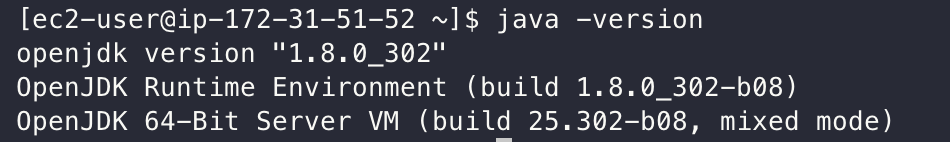

# EC2에 Java8 설치

> Amazon Linux 2 CentOS 기반으로 진행합니다.

## Java 설치

진행하기 앞서 최신으로 업데이트 합니다.
```bash
sudo yum update -y
```

Java8를 설치하겠습니다.
```bash
sudo yum install -y java-1.8.0-openjdk-devel.x86_64
```

설치 완료 후 Java 8 버전인지 확인합니다.
```bash
java -version
```

