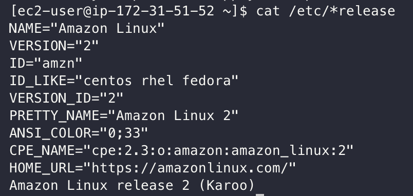
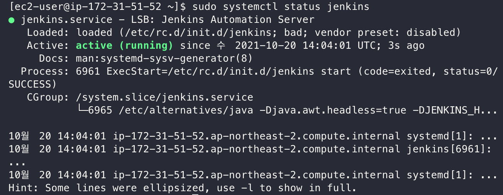
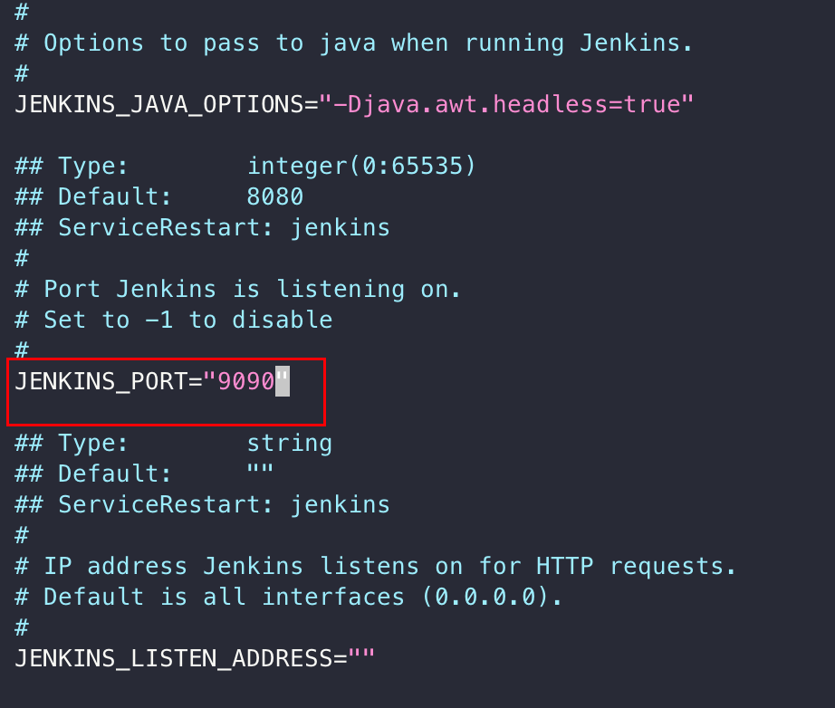
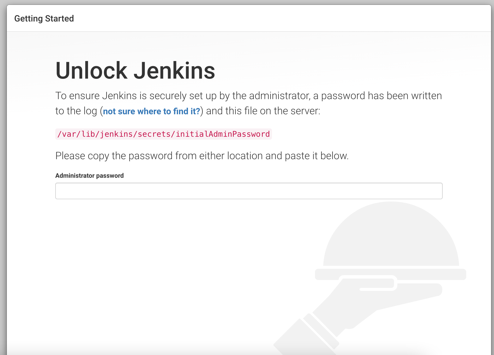

# EC2에 Jenkins(젠킨스)를 설치하고 배포하기 #1

> Amazon Linux 2 CentOS 기반으로 진행합니다.

## 버전확인 방법

```bash
cat /etc/*release
```



## Jenkins 설치

진행하기 앞서 기본 패키지를 최신으로 업데이트 합니다.
```bash
sudo yum update -y
```

Jenkins를 설치하기 전에 [Git](https://github.com/ssoop-yoon/awesome-blog/tree/main/Git/EC2_Git_%EC%84%A4%EC%B9%98), [Java](https://github.com/ssoop-yoon/awesome-blog/tree/main/DevOps/EC2_Java_%EC%84%A4%EC%B9%98) 를 먼저 설치해야합니다.

Java 설치가 완료 되면 Jenkins 설치를 하겠습니다.
```bash
sudo wget -O /etc/yum.repos.d/jenkins.repo https://pkg.jenkins.io/redhat-stable/jenkins.repo
sudo rpm --import https://pkg.jenkins.io/redhat/jenkins.io.key
sudo amazon-linux-extras install -y epel
sudo yum install -y jenkins
```

Jenkins 설치가 완료되면 실행하면 됩니다.

```bash
sudo systemctl start jenkins
```

정상적으로 Jenkins 설치가 됐는지 확인합니다.

```bash
sudo systemctl status jenkins
```


Jenkins는 기본적으로 8080 포트를 사용합니다.  
하지만, 대부분의 소프트웨어가 8080을 사용하기 때문에 다른 포트로 변경할 필요가 있습니다.

```bash
sudo vim /etc/sysconfig/jenkins
```

다음과 같이 JENKINS_PORT를 9090으로 수정합니다.




저장하고 jenkins를 다시 시작합니다.
```bash
sudo systemctl restart jenkins
```

젠킨스 설치가 모두 완료하였습니다.  
이제 웹브라우저로 IP:9090 주소로 들어가시면 젠킨스에 접속할 수 있습니다. 


