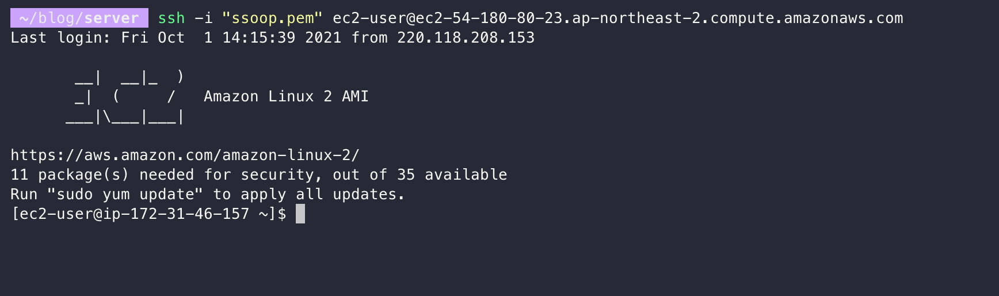
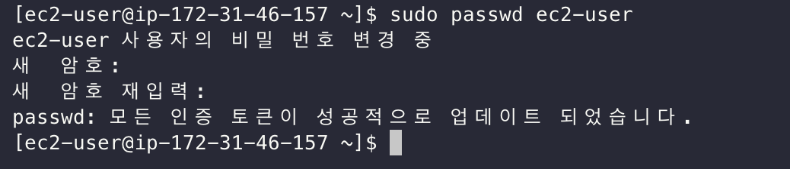
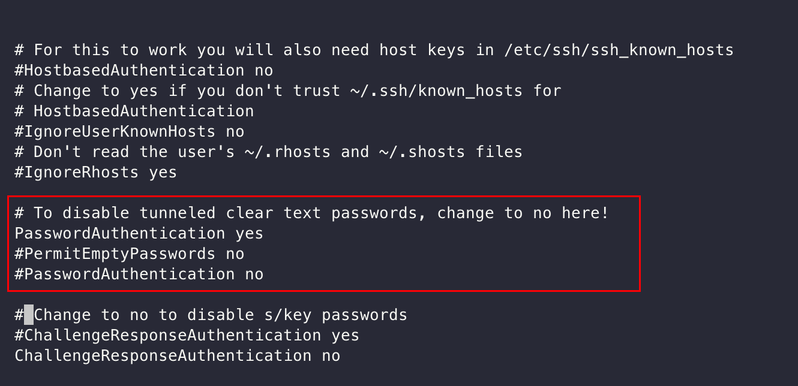
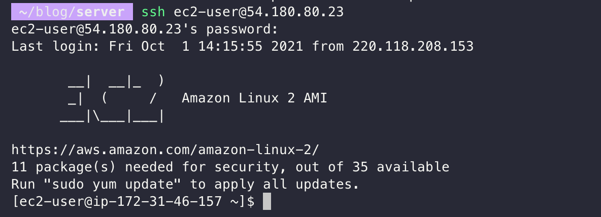

# AWS EC2 Pem키 없이 비밀번호로 접속하기

> AWS 계정이 있어야하며 없는 경우 계정 생성 후 진행하시면 됩니다.
EC2의 경우 Amazon Linux 2 기준으로 진행합니다.

EC2 생성 과정은 생략하며 EC2 생성 방법을 모르시면 [EC2 생성하기](https://ssoop.tistory.com/8) 를 참고하시면 됩니다.

### 1. EC2 접속하기

다음과 같은 명령어로 EC2를 접속하시면 됩니다.
```bash
ssh -i "pem 파일" ec2-user@IP주소
```


### 2. EC2 비밀번호 설정

```bash
sudo passwd ec2-user
```


### 3. EC2 비밀번호로 접속 권한 설정

```bash
sudo vi /etc/ssh/sshd_config
```

`PasswordAuthentication yes`를 주석해제하고 `PasswordAuthentication no`를 주석처리합니다.

```bash
PasswordAuthentication yes
#PasswordAuthentication no
```



### 4. sshd 재시작

```bash
sudo service sshd restart
```

### 5. 비밀번호로 접속확인

EC2에 다시 접속하여 확인해보시면 됩니다.

```bash
ssh ec2-user@IP 주소
```


### 마무리

pem키파일 없이 비밀번호로 EC2 접속 방법을 알아봤습니다.  
ssh 접속 방법은 보안그룹을 설정하여 내 IP에서만 접속 가능하게 설정하는 것을 추천드립니다.

