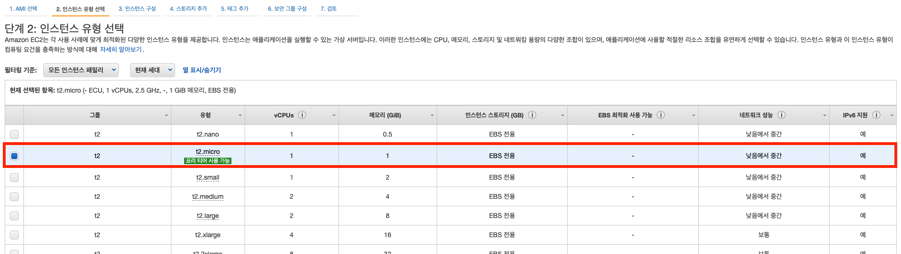

# AWS EC2 생성

> AWS 계정이 있어야하며 없는 경우 계정 생성 후 진행하시면 됩니다.
EC2의 경우 Amazon Linux 2 기준으로 진행합니다.

# EC2 생성

### 1. 인스턴스 시작

**인스턴스 시작** 하기전에 **서울** 리전인지 확인 후 진행하시길 바랍니다.
**서울** 리전인 경우 **인스턴스 시작** 버튼을 클릭합니다.

### 2. AMI 선택

[AMI](https://docs.aws.amazon.com/ko_kr/AWSEC2/latest/UserGuide/AMIs.html)는 AWS에서 여러가지 환경의 이미지를 제공하고 이미지를 통해 인스턴스를 쉽게 생성할 수 있습니다.
**Amazon Linux 2 AMI(HVM), SSD Volume Type** 인스턴스로 선택합니다.

### 3. 인스턴스 유형 선택

[인스턴스 유형](https://docs.aws.amazon.com/ko_kr/AWSEC2/latest/UserGuide/launching-instance.html#choose-an-instance-type-page)에서는 원하는 서버 사양을 선택하여 진행할 수 있습니다.
지금은 프리티어를 사용할 예정이므로 **프리티어로 선택** 후, 다음으로 넘어갑니다.

### 4. 인스턴스 구성

[인스턴스의 세부 구성](https://docs.aws.amazon.com/ko_kr/AWSEC2/latest/UserGuide/launching-instance.html#configure_instance_details_step)이며 기본값으로 설정해도 됩니다.

### 5. 스토리지 추가
[스토리지](https://docs.aws.amazon.com/ko_kr/AWSEC2/latest/UserGuide/launching-instance.html#step-4-add-storage)를 설정하는 곳이며 HDD/SSD를 추가한다고 보시면 됩니다.
여러 볼륨 유형이 있지만 기본값으로 설정하고 진행합니다.

### 6. 태그 추가
[태그](https://docs.aws.amazon.com/ko_kr/AWSEC2/latest/UserGuide/Using_Tags.html)는 고유 메타데이터를 태그의 형태로 각 리소스에 배정하면 인스턴스, 이미지 및 기타 Amazon EC2 리소스를 쉽게 관리할 수 있습니다.
**Name 키**로 **EC2 인스턴스 이름**을 지정해주시면 됩니다. 설정하지 않아도 무방합니다.

### 7. 보안 그룹 구성
[보안 그룹 구성](https://docs.aws.amazon.com/ko_kr/AWSEC2/latest/UserGuide/ec2-security-groups.html)은 EC2 인스턴스에 대한 수신 및 발신 트래픽을 제어하는 가상 방화벽 역할을 합니다.
**EC2 인스턴스에 접속하기 위해 SSH 22번 포트는 내 IP로 설정**하고
**HTTP(80) 규칙을 추가**해주시면 됩니다.

### 8. 인스턴스 시작 검토
설정한 사항들을 확인하고 **시작하기** 버튼을 클릭합니다.

### 9. 키페어 생성/선택
키 페어는 SSH로 인스턴스 접속하기 위해 필요한 파일입니다.
**절대 유출되어서 안되고 잃어버려도 안되기 때문에 꼭 잘 보관해야합니다.**

이미 키 페어가 존재할 경우 인스턴스 시작을 누르시면 됩니다.
키 페어가 존재하지 않으면 새롭게 **키 페어를 생성**합니다.
**키 페어 이름**을 입력 후 **키 페어 다운로드**를 합니다.
**키 페어 다운로드** 후 **인스턴스 시작** 버튼을 클릭하여 인스턴스를 시작합니다.

### 10. 인스턴스 확인
다음과 같이 **인스턴스 상태**가 대기중에서 **실행 중**으로 **상태 검사**가 초기화에서 **2/2 검사 통과**가 되면 성공적으로 인스턴스를 생성된 것입니다.

### 11. 인스턴스 연결

인스턴스를 클릭하고 오른쪽 마우스를 눌러 **연결** 버튼을 클릭합니다.

이제 터미널로 접속하여 인스턴스를 연결하시면 됩니다.

### 12. 인스턴스 접속
1. 다운받은 키페어 있는 위치로 이동합니다.
2. chmod 400 키 페어 이름.pem 명령어 입력합니다. (읽기 권한 설정)
3. 예시에 나온 것처럼 입력하시고 **yes**를 입력하면 인스턴스에 접속이 됩니다.

