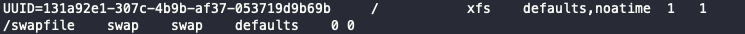
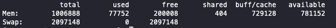

# AWS EC2 프리티어 메모리 부족 해결방법

EC2 프리티어를 사용할 경우 메모리 부족으로 프로그램이 동작하지 않는 경우가 발생합니다.  
프리티어가 아닌 경우 굳이 사용하지 않아도 됩니다.

## 스왑 파일 생성

### 스왑 파일을 생성하기 전 주의사항
지정한 블록 크기는 인스턴스에서 사용 가능한 메모리보다 작아야 합니다. 그렇지 않으면 "memory exhausted" 오류가 발생합니다.  
dd 명령에서 스왑 파일은 2GB(128MB * 16)입니다.

```bash
sudo mkdir /var/swap
sudo touch /var/swap/swapfile 
sudo dd if=/dev/zero of=/var/swap/swapfile bs=128M count=16
```

정상적으로 블록 크기가 설정 됐는지 확인해보자
```bash
ls -l /var/swap
```



## 스왑 파일 설정

스왑파일 권한 부여, 스왑파일 영역 설정 및 스왑 파일 사용하도록 설정합니다.

```bash
sudo chmod 600 /var/swap/swapfile 
sudo mkswap /var/swap/swapfile
sudo swapon /var/swap/swapfile
```

정상적으로 성공했는지 확인해보자
```bash
sudo swapon -s
```

## 스왑 파일 등록

```bash
sudo vi /etc/fstab
```

파일 끝에 추가합니다.
```bash
/var/swap/swapfile    none    swap    defaults    0 0 
```



## 최종 확인
메모리를 확인해보면 정상적으로 메모리가 늘어난 것을 확인할 수 있습니다.
```bash
free
```


### 참고
https://aws.amazon.com/ko/premiumsupport/knowledge-center/ec2-memory-swap-file/