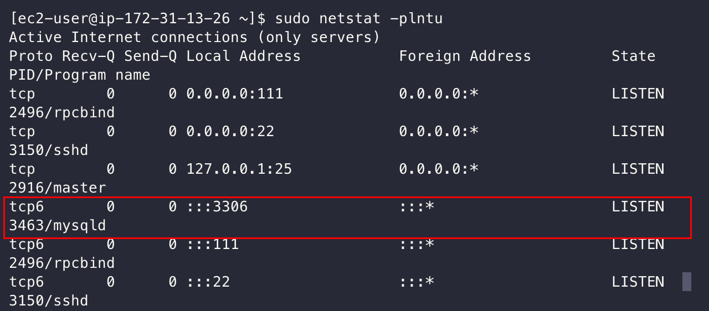

# [AWS] EC2에 MySQL 설치(MySQL 5.7)

**AWS EC2에 MySQL 설치방법을 정리하고자 합니다.**

> EC2의 경우 Amazon Linux 2 기준으로 진행합니다.


# MySQL 설치 방법

### 1. MySQL 설치

```bash
sudo yum update -y
sudo yum localinstall -y https://dev.mysql.com/get/mysql57-community-release-el7-11.noarch.rpm
sudo yum install -y mysql-community-server
```
### 2. MySQL 실행

```bash
sudo systemctl enable mysqld
sudo systemctl start mysqld
```

### 3. MySQL 체크

```bash
mysql --version
sudo netstat -plntu
```


3306 포트가 떠있다면 정상적으로 실행되고 있다는 의미입니다.
만약 3306 포트가 안보인다면 재실행 해보면 됩니다.
```shell
sudo systemctl restart mysqld
```


### 4. MySQL 패스워드 설정

```bash
sudo grep 'temporary.*root@localhost' /var/log/mysqld.log | tail -n 1 | sed 's/.*root@localhost: //'
```

```bash
mysql -u root -p
```
해당 패스워드를 복사하고 붙여넣기하여 로그인을 합니다.


```bash
mysql> ALTER USER 'root'@'localhost' IDENTIFIED BY '새로운 암호';
mysql> FLUSH PRIVILEGES;
```


### 5. 외부 접근권한 설정
```bash
mysql> GRANT ALL privileges ON *.* TO root@'%' IDENTIFIED BY '비밀번호';
mysql> FLUSH PRIVILEGES;
```


### 참고
https://www.lesstif.com/dbms/rhel-centos-ubuntu-mysql-5-6-5-7-24445108.html
https://bamdule.tistory.com/22