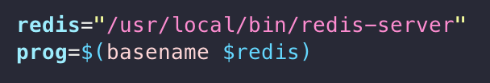

# [AWS] EC2에 Redis 설치

**AWS EC2에 Redis 설치방법을 정리하고자 합니다.**

> EC2의 경우 Amazon Linux 2 기준으로 진행합니다.
Redis의 경우 작성기준일로 6.2.5가 최신이므로 최신버전을 설치합니다.


# Redis 설치

### 1. Redis를 설치하기 이전에 linux update를 하고 gcc make를 설치해야합니다.

```bash
sudo yum update -y
sudo yum install gcc make -y
```
### 2. Redis 설치 및 압축풀고 gcc make로 컴파일

```bash
wget http://download.redis.io/releases/redis-6.2.5.tar.gz
tar xzf redis-6.2.5.tar.gz
cd redis-6.2.5
make
```
### 3. 디렉토리 생성 및 Redis 설정 파일 복사
```bash
sudo mkdir /etc/redis
sudo mkdir /var/lib/redis
sudo cp src/redis-server src/redis-cli /usr/local/bin/
sudo cp redis.conf /etc/redis/
```
### 4. redis.conf 설정파일 수정
```bash
sudo vi /etc/redis/redis.conf
```

아래와 같이 해당 부분을 수정하면 됩니다.
찾기가 힘들다면 입력모드에서 '/' 명령어로 쉽게 찾아서 변경할 수 있습니다.
예) /bind
```bash
bind 0.0.0.0
daemonize yes
logfile /var/log/redis_6379.log
dir /var/lib/redis 
```

### 5. Redis 서버 초기화 스크립트 다운로드
```bash
wget https://raw.github.com/saxenap/install-redis-amazon-linux-centos/master/redis-server
```

### 6. 다운 받은 파일을 /etc/init.d로 옮기고 권한을 설정합니다.
```bash
sudo mv redis-server /etc/init.d
sudo chmod 755 /etc/init.d/redis-server
```

### 7. redis-server 파일에 redis 항목 체크
```bash
sudo vim /etc/init.d/redis-server
```


### 8. redis-Server Auto-Enable 설정
```bash
sudo chkconfig --add redis-server
sudo chkconfig --level 345 redis-server on
```

### 9. redis 실행
```bash
sudo service redis-server start
redis-cli ping
```

### 10. redis 접속
```bash
redis-cli
127.0.0.1:6379>
```


### 참고
https://redis.io/topics/quickstart

https://github.com/saxenap/install-redis-amazon-linux-centos