# Jenkins GitHub Token으로 연동

개인적으로 SSH 연동을 추천합니다만, Github Token으로 연동하는 방법도 정리하고자 합니다.

## Jenkins GitHub 연동 및 빌드

오른쪽 상단에 있는 프로필을 눌러 `Settings`화면으로 이동합니다.

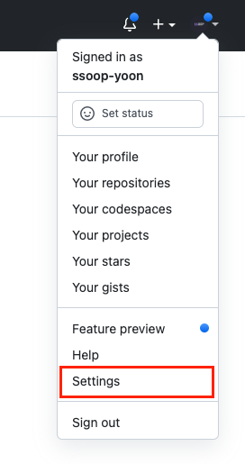

`Developer Settings`을 클릭합니다.

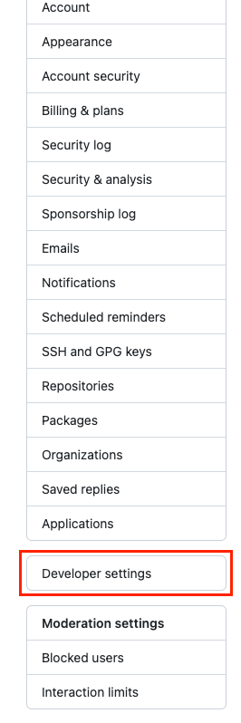

Private 저장소를 접근하기 위해 토큰을 발행하겠습니다.  
`Personal access tokens` 탭을 클릭하고 `Generate new token`을 클릭합니다.

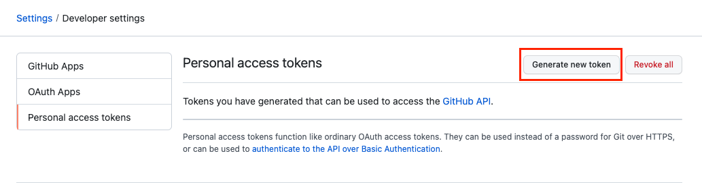

토큰명, 유효기간, 스코프 설정을 하고 토큰을 생성합니다.

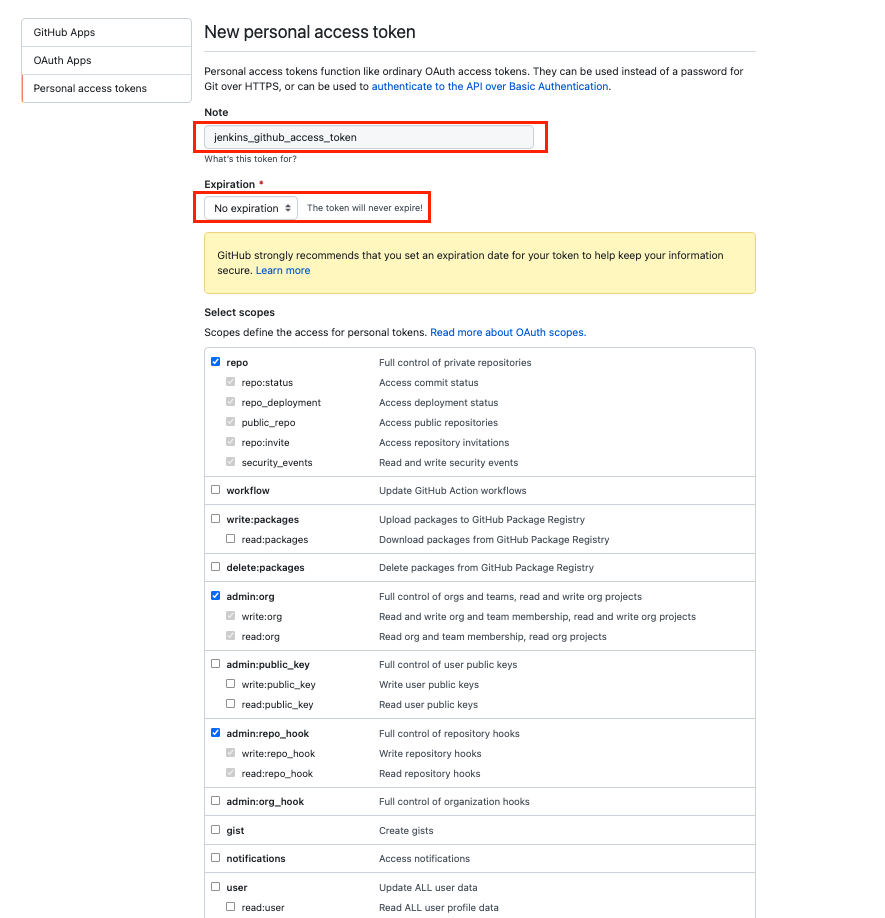

해당 토큰을 복사해서 잘 보관해둡니다.   
(나중에 다시 확인이 불가능하니 메모장이나 다른 곳에 따로 잘 보관해둡니다.)

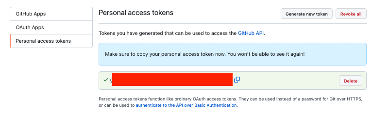

이제 GitHub Server 를 등록해보겠습니다.  
다시 Jenkins 페이지로 돌아가서 `Jenkins 관리`을 클릭하고 `시스템 설정`을 클릭합니다.

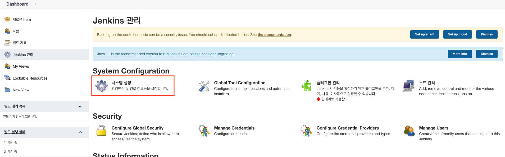

`Add GutHub Server` 을 클릭합니다.

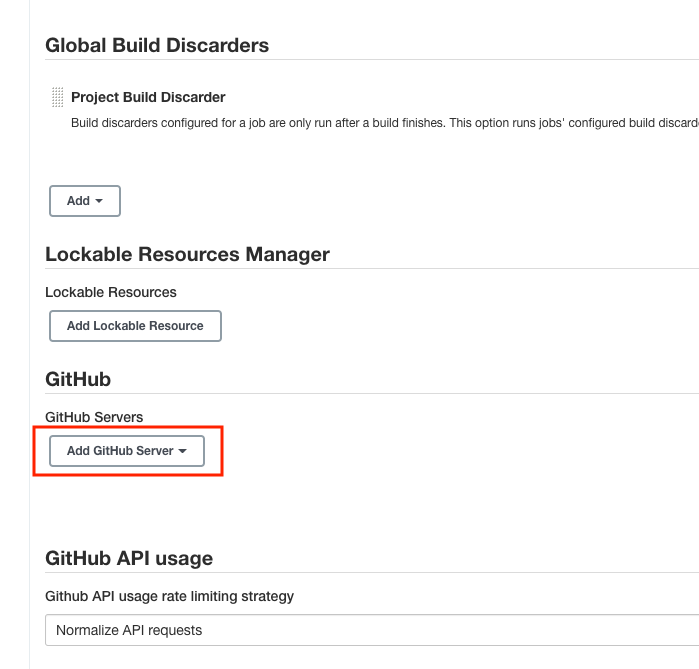

`Name`을 입력하고 Credentials Add Jenkins 클릭하여 계정을 등록합니다.

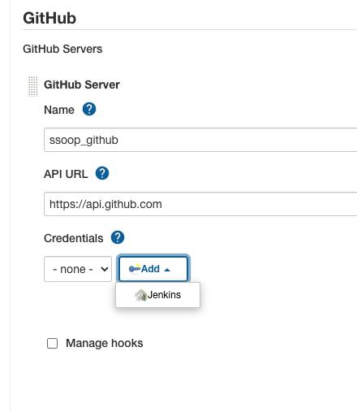

Kind는 `Secret Text`, Secret 은 아까 복사해둔 `Github access token`, ID는 `Github 계정아이디`를 넣으시면 됩니다.

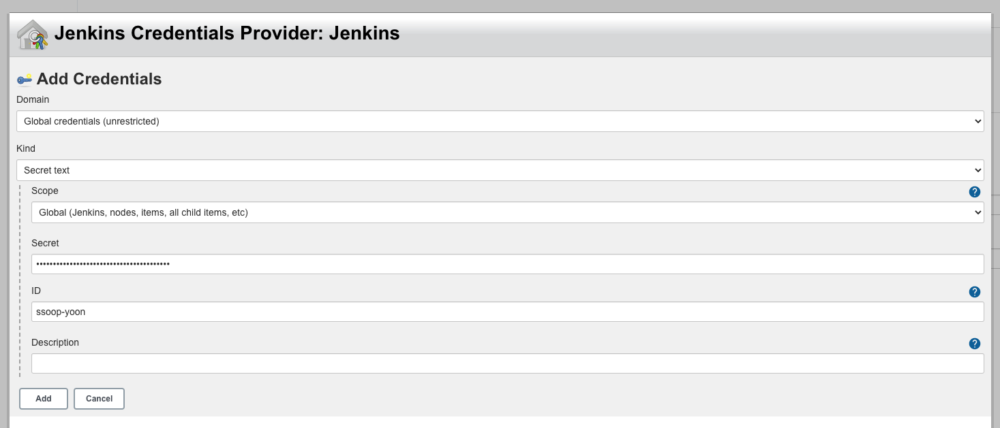

Credentials 자신의 계정을 클릭 후 `Test Connection` 을 클릭하여 정상적으로 연결이 됐는지 확인해봅니다.

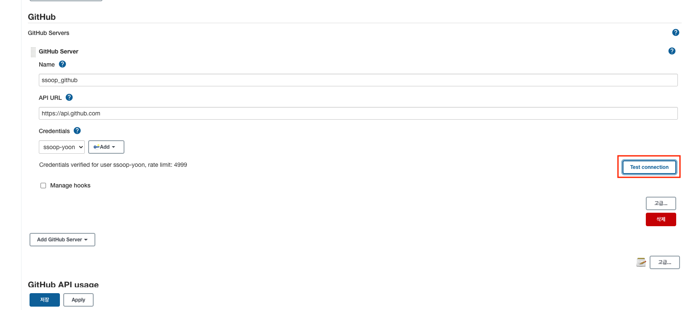

## 프로젝트(Job) 생성 및 빌드

`새로운 Item` 또는 `Create a job` 클릭하여 Job을 하나 생성합니다.

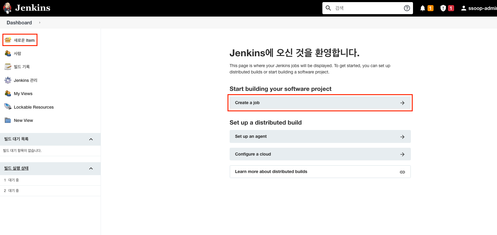

Project 명을 입력하고 `Freestyle project`를 클릭하고 `OK`버튼을 클릭합니다.

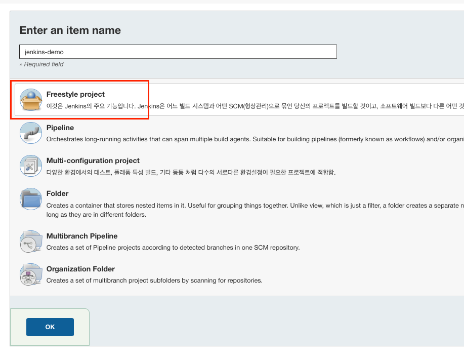

`GitHub project` 체크하고 Github Project Url를 입력합니다.

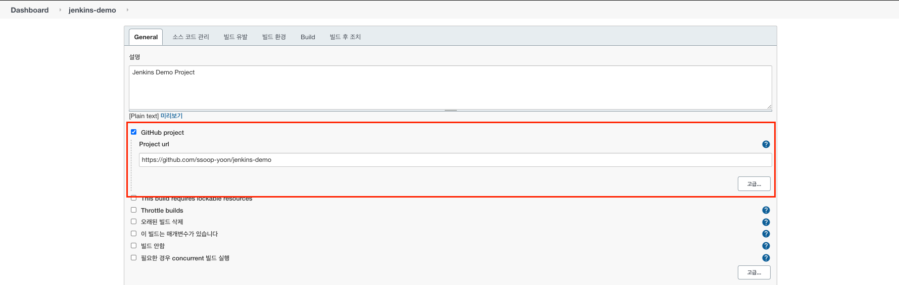

Github의 Https url 주소를 복사합니다.

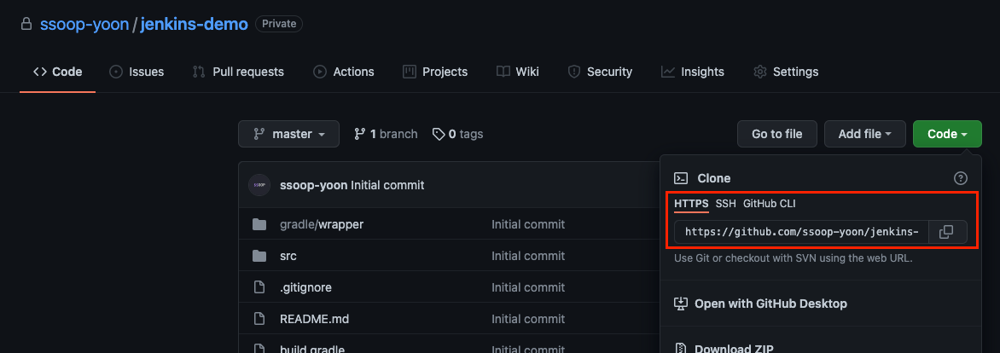

복사한 URL 주소를 붙여넣고 `Credentials` Add 클릭합니다.

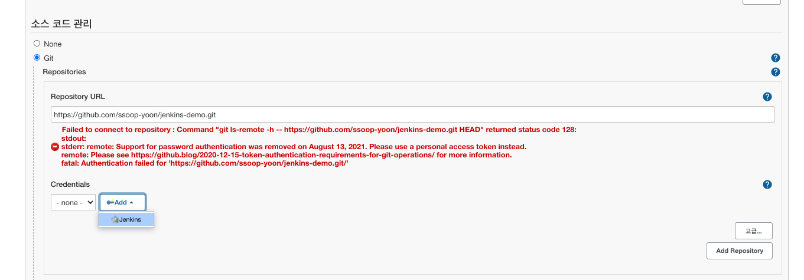

Kind는 `Username with password`,  
Username은 `Github 계정 아이디`,  
Secret 은 아까 복사해둔 `Github access token`을 넣으시면 됩니다.

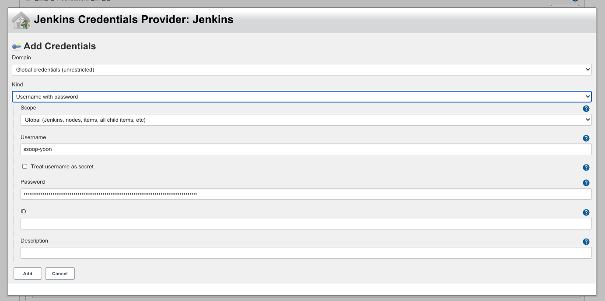

`Credentials` 계정을 추가하고 저장누르시면 됩니다.

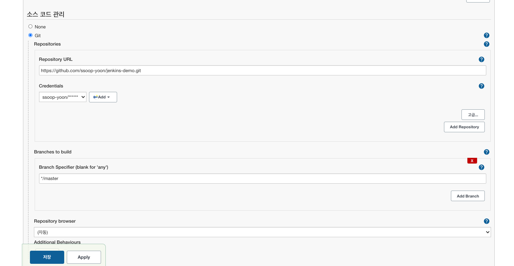

`Build Now` 클릭합니다.

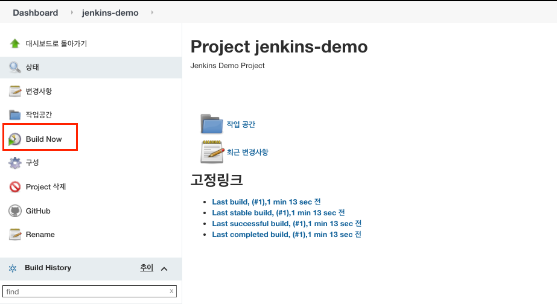

들어가서 `Console Output`을 확인하면 정상적으로 Github Project 소스를 받은것을 확인 할 수 있습니다. 

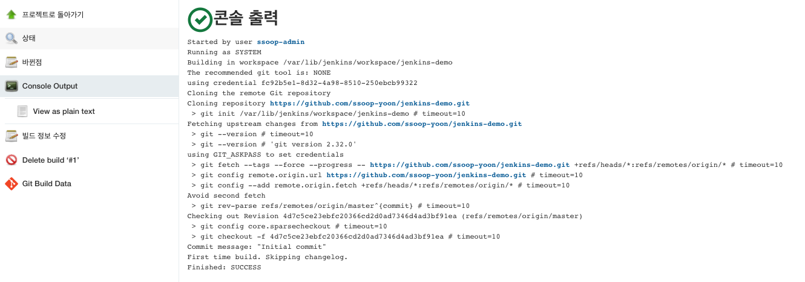

