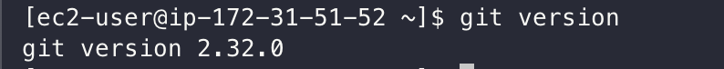

# EC2에 Git 설치

> Amazon Linux 2 CentOS 기반으로 진행합니다.

## Java 설치

진행하기 앞서 최신으로 업데이트 합니다.
```bash
sudo yum update -y
```

git를 설치하겠습니다.
```bash
sudo yum install git -y
```

설치 완료 후 git 버전을 확인합니다.
```bash
git version
```

