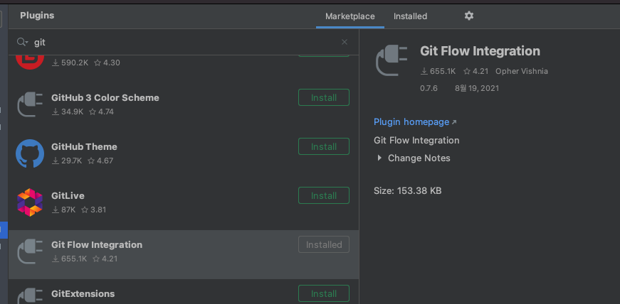
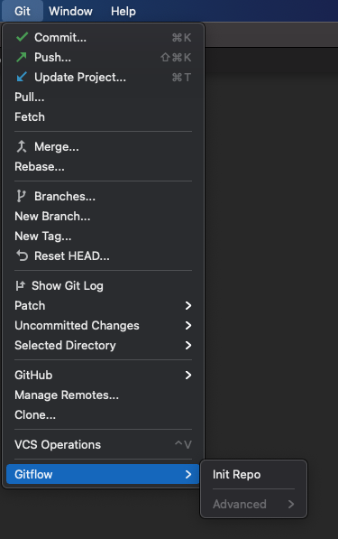
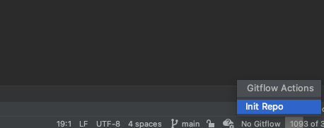
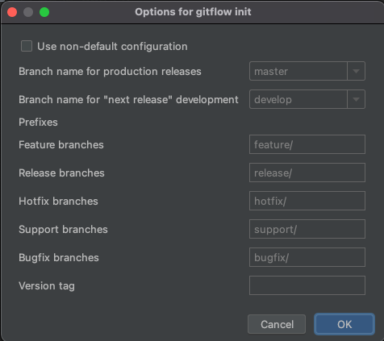

# Git Flow Integration으로 사용하는 방법

현재 Git을 사용하고 있고 Git Flow에 따라 개발을 진행하고 있습니다.  
이전에는 Source Tree(소스트리) + Eclipse 에서 진행하고 있었는데 이번에 IntelliJ로 넘어오면서 진행방법을 변경하려고 합니다.    
IntelliJ에서 Git Flow Integration 으로 쉽게 진행 방법을 정리하고자 합니다.

## 설치
Mac OS를 사용하고 있으므로 homebrew를 통해 git flow를 설치합니다.
```bash
brew install git-flow-avh
```

git flow가 설치가 완료되었으면 IntelliJ에서 **Git Flow Integration** 플러그인을 설치합니다.



## Git Flow 사용

git 메뉴의 Gitflow 또는 오른쪽 하단에 No Gitflow로 **Init Repo**로 클릭합니다.

#### 1. git 메뉴



#### 2. 오른쪽 하단의 No Gitflow




브랜치 설정화면이 나오는데 기본 옵션으로 많이 사용하고 있기때문에 수정하지 않고 OK 버튼을 누릅니다.



이제 이전에 사용했던 방법으로 GitFlow를 사용하시면 됩니다.

### 참고
https://jojoldu.tistory.com/268


