# 깃허브(GitHub) 연동하기 (Spring Boot, IntelliJ)

> 총 두 가지 방법으로 연동하는 법을 전달하려고 합니다.
1. 깃허브 저장소를 만든 후 Spring Boot 프로젝트 연동
2. Spring Boot 프로젝트를 만든 후 IntelliJ 에서 깃허브 저장소 생성하고 연동

# 깃허브(GitHub) 연동하기

### 1. 깃허브 저장소를 만든 후 Spring Boot 프로젝트 연동하기

1. 깃허브에서 저장소를 생성합니다.
   Add a README file
   Add .gitignore
   Choose a license 는 선택하지 않고 생성하겠습니다.
   
   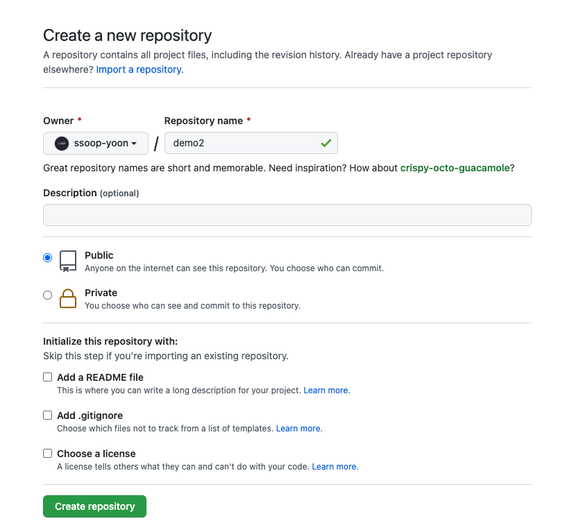

2. 하나의 Spring Boot Project를 생성하거나 이미 만들어진 Spring Boot Project를 엽니다.
   그리고 상단의 **VCS** 클릭하고 **Create Git Repository...** 를 클릭합니다.
   클릭하고나면 디렉토리 창이 뜨는데 **Open** 버튼을 클릭합니다.
   
   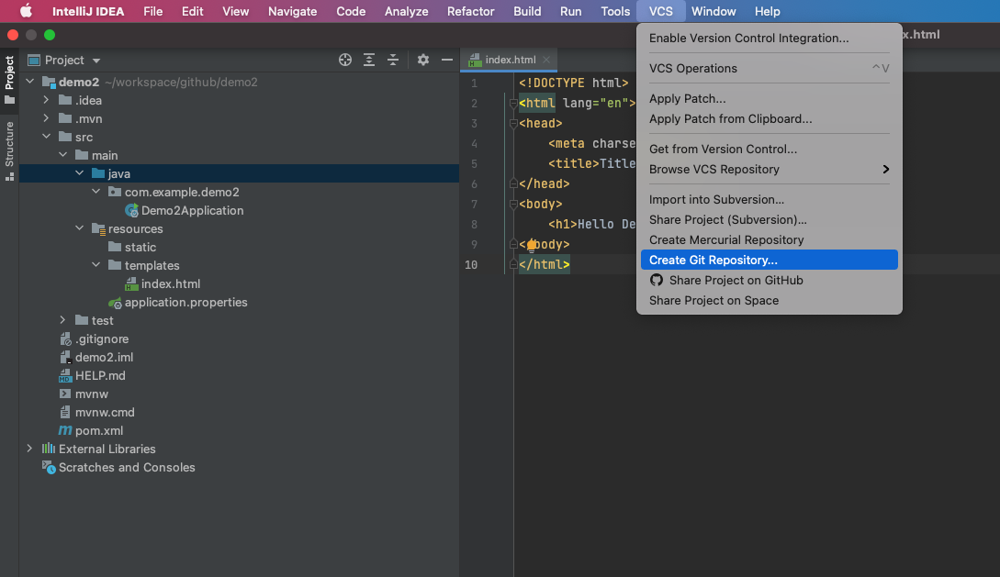

3. 다음과 같이 파일들이 빨간색처럼 표시되면 됩니다. 아직 파일들이 스테이징 영역(staging area)에 추가되지 않는 상태입니다.
   
   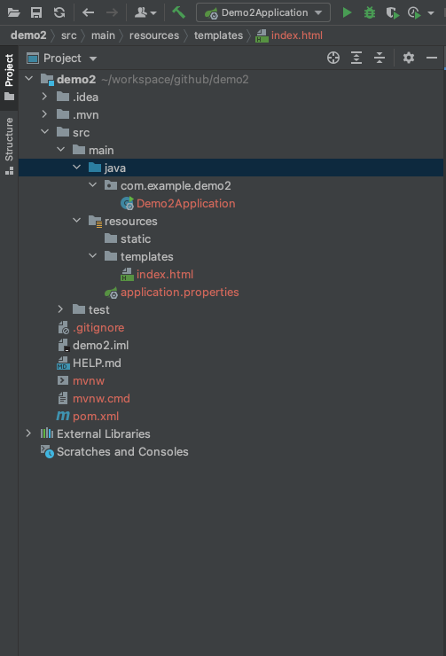

4. 상단바를 보면 기존에 VCS에서 Git으로 변경된 걸 확인할 수 있습니다.
   **Git**을 누르고 **Manage Remotes...**를 클릭합니다.
   
   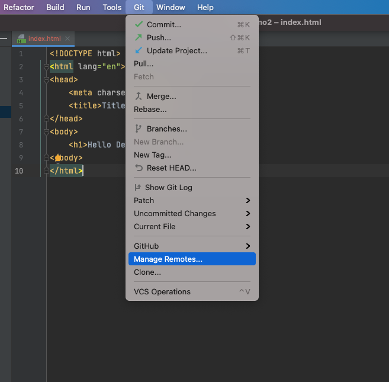

5. Git 저장소를 넣어야하며 **+** 버튼을 클릭하여 위에서 **GitHub에서 만든 저장소 주소**를 넣으시면 됩니다.
   
   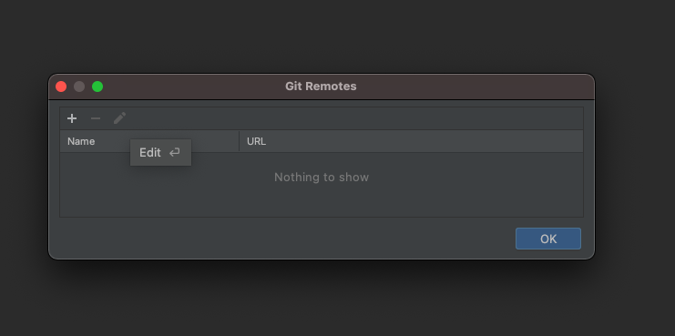
   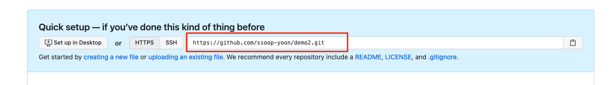

6. **Git Remote** 설정이 완료되었다면 **OK** 버튼을 클릭합니다.
   
   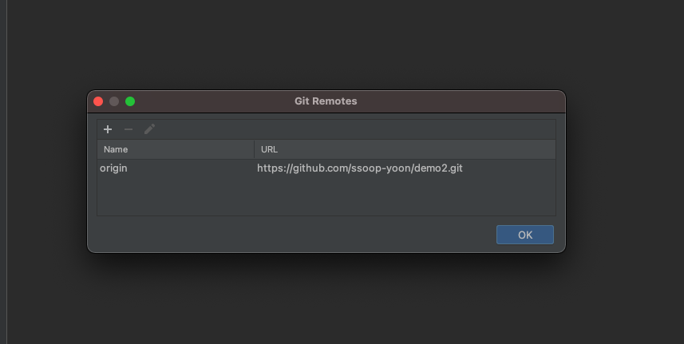

7. 상단바에 있는 Git를 누르고 **Commit**를 클릭합니다.
   
   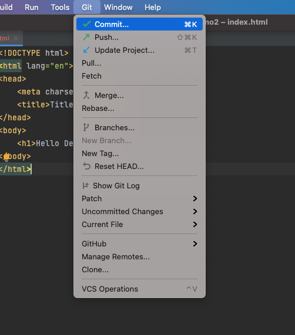

8. **모든 파일을 체크**하고 **Commit Message**를 작성합니다. 그리고 **Commit** 버튼을 클릭합니다.
   
   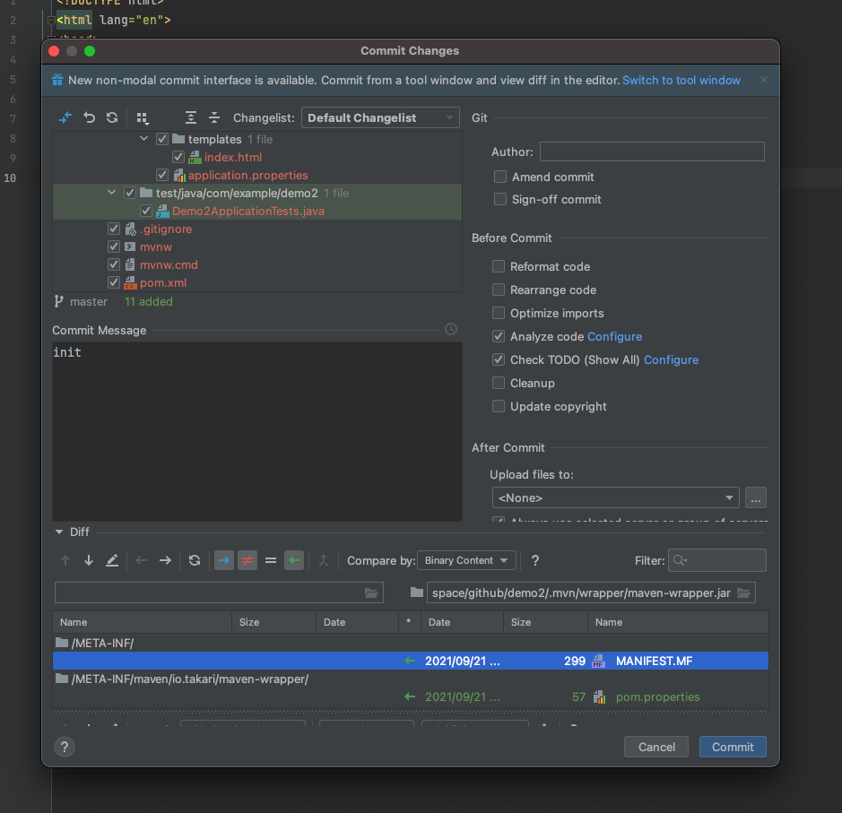

9. 다시 상단바에 있는 Git를 누르고 **Push**를 클릭합니다.
   
   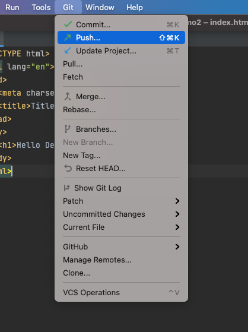

10. Commit 하였던 파일들을 GitHub 저장소에 올린다고 보시면 됩니다. **Push**를 클릭합니다.
    
   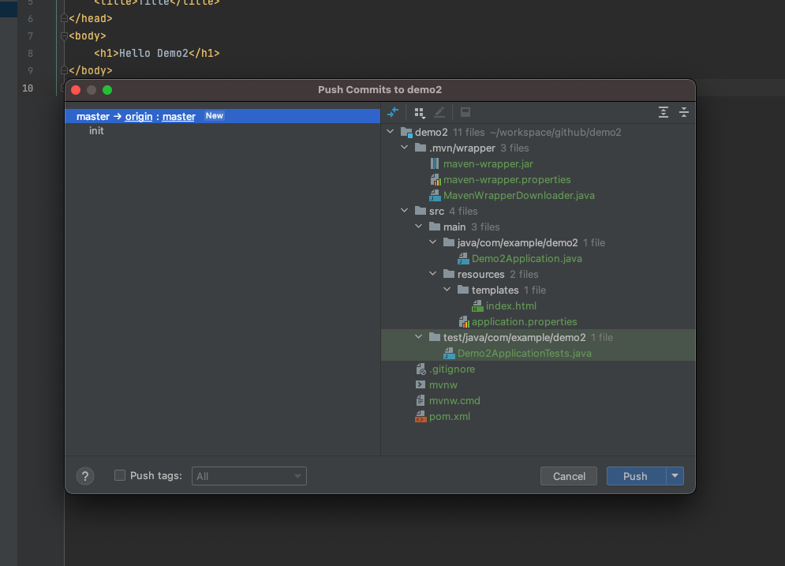

11. 만약 로그인이 되어 있지 않다면 GitHub 로그인을 진행하시면 됩니다.
    IntelliJ에 GitHub가 로그인이 되어있다면 자동으로 올라가게 됩니다.
    
   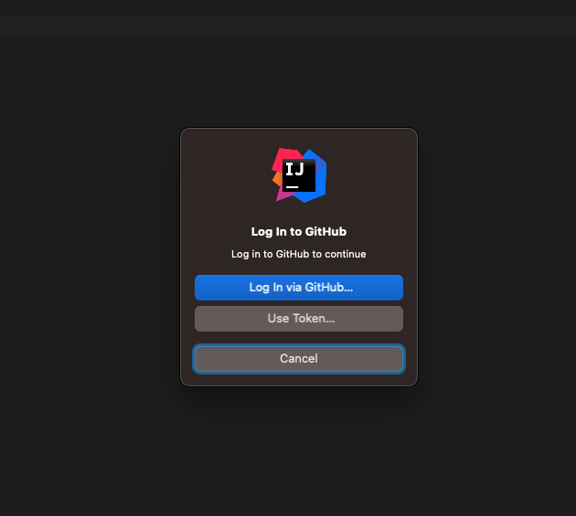

12. GitHub 저장소에 들어가셔서 새로고침을 하시면 저희 프로젝트가 GitHub 연동이 성공적으로 된 것입니다.
    
   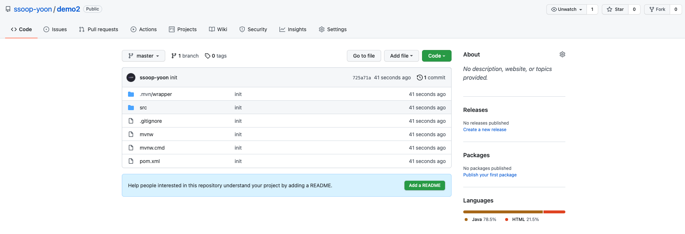

### 2. Spring Boot 프로젝트를 만든 후 깃허브 저장소 생성 및 연동

이번에는 더 간단하게 IntelliJ에서 깃허브 저장소를 만들고 연동까지 진행하는 방법을 알려드리겠습니다.

1. 상단의 VCS를 누르고 **Share Project On GitHub**를 클릭합니다.
   
   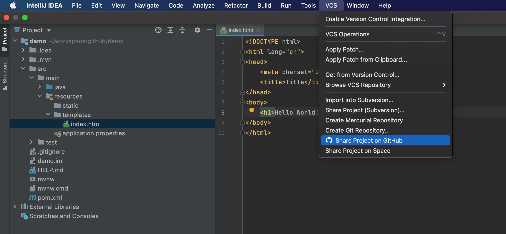

2. GitHub에 만들 **Repository name을 입력**하고 **Share** 버튼을 클릭합니다. (Private를 체크하면 비공개로 Repository로 만들 수 있습니다.)
   
   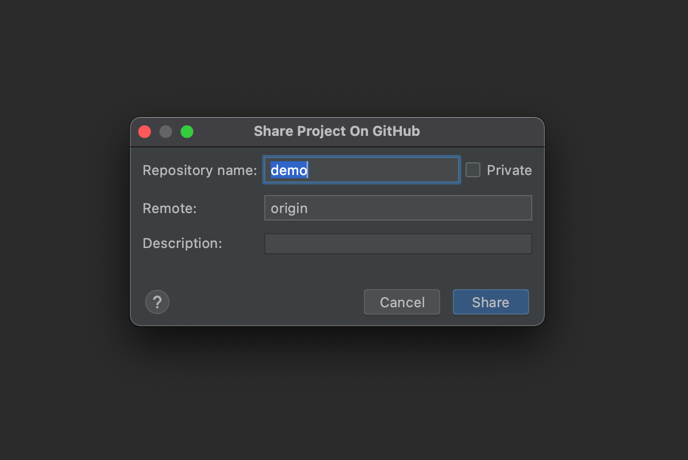

3. 프로젝트의 파일들을 **Add**하고 **Commit** 및 **Push**까지 한 번에 진행합니다.
   
   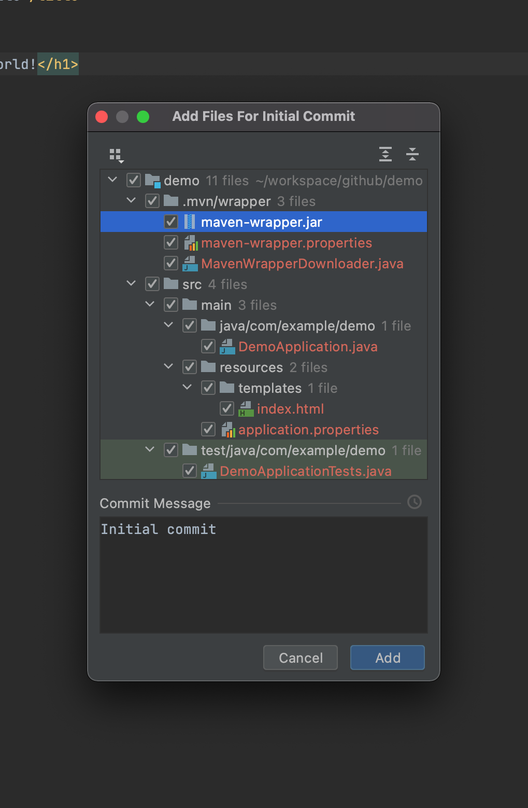

4. 깃허브로 들어가시면 **2번에 Repository name**으로 만든 저장소가 생기고 Spring Boot 파일들까지 올라간것을 확인 할 수 있습니다.
   
   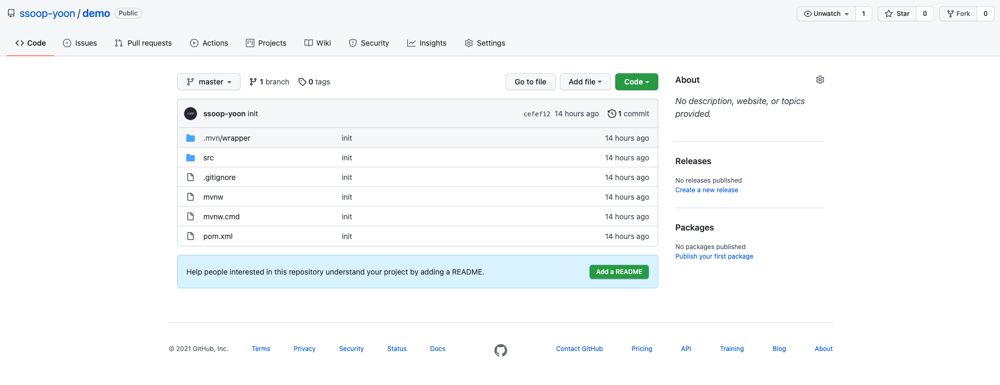