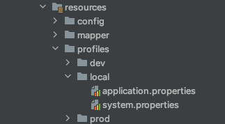
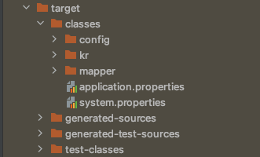

# Spring Build 환경설정별 프로필 적용하기


### 웹 애플리케이션 배포 시, 서버 환경별 값을 달리해야하는 경우가 있기 때문에 별도로 관리하는 방법을 정리합니다. (Pom.xml 기반)

폴더구조



pom.xml 설정
```xml
<profiles>
    <profile>
        <id>local</id>
        <activation>
            <activeByDefault>true</activeByDefault>
        </activation>
        <properties>
            <build.environment>local</build.environment>
        </properties>
    </profile>
    <profile>
        <id>dev</id>
        <properties>
            <build.environment>dev</build.environment>
        </properties>
    </profile>
    <profile>
        <id>prod</id>
        <properties>
            <build.environment>prod</build.environment>
        </properties>
    </profile>
</profiles>
<build>
    <finalName>spring-webservice</finalName>
    <resources>
        <resource>
            <directory>${basedir}/src/main/resources</directory>
            <filtering>true</filtering>
            <excludes>
                <exclude>profiles/**/**</exclude>
            </excludes>
        </resource>
        <resource>
            <directory>${basedir}/src/main/resources/profiles/${build.environment}</directory>
        </resource>
    </resources>
</build>
```

build 후 target 디렉토리에 공용 resources 폴더 및 환경설정에 해당하는 부분만 추가한것을 확인할 수 있다.

