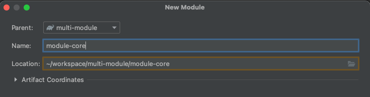

# SpringBoot MultiModule(멀티모듈) 구성하기

### 멀티모듈이란?
프로젝트안에서 모듈로 내부 라이브러리로 구성하여 여러 모듈에서 사용하는 방식을 얘기합니다.  
모듈의 자세한 설계로는 [멀티모듈 설계 이야기 with Spring, Gradle](https://techblog.woowahan.com/2637/) 를 참고하시면 될 것 같습니다.

> Spring Boot 2.5.5  
> Gradle 6 버전

## Spring Boot 멀티 모듈 구성하기

### 프로젝트 구조

- Root : multi-module
- Module: admin, api, core


### 프로젝트 생성

Gradle 프로젝트로 생성합니다.


원하는 프로젝트명 입력합니다.


새로운 모듈을 생성합니다.


프로젝트 생성했을 때와 똑같이 Gradle 모듈로 생성합니다.


Parent: Root 프로젝트인 `multi-module`로 설정합니다.




나머지 `module-api`, `module-admin` 도 위와 똑같이 생성해줍니다.

### Root

Root에 있는 `src` 폴더는 사용하지 않기 때문에 삭제해줍니다.  
그리고 `setting.gradle`, `build.gradle`를 아래와 같이 수정합니다.

- setting.gradle

```groovy
rootProject.name = 'multi-module'
include 'module-api'
include 'module-admin'
include 'module-core'
```

- build.gradle

```groovy
buildscript {
    ext {
        springBootVersion = '2.5.5'
    }
    repositories {
        mavenCentral()
    }
    dependencies {
        classpath("org.springframework.boot:spring-boot-gradle-plugin:${springBootVersion}")
        classpath "io.spring.gradle:dependency-management-plugin:1.0.11.RELEASE"
    }
}

subprojects {
    group = 'com.ssoop.blog'
    version = '0.0.1-SNAPSHOT'

    apply plugin: 'java'
    apply plugin: 'org.springframework.boot'
    apply plugin: 'io.spring.dependency-management'

    sourceCompatibility = 1.8

    repositories {
        mavenCentral()
    }

    dependencies {
        compileOnly 'org.projectlombok:lombok'
        annotationProcessor 'org.projectlombok:lombok'
        annotationProcessor "org.springframework.boot:spring-boot-configuration-processor"
        implementation 'org.springframework.boot:spring-boot-starter-web'
        implementation 'org.springframework.boot:spring-boot-starter-jdbc'
        testImplementation 'org.springframework.boot:spring-boot-starter-test'
    }
}
```

### Module-Core

```groovy
bootJar {
    enabled = false
}

jar {
    enabled = true
}

dependencies {
    implementation 'org.mybatis.spring.boot:mybatis-spring-boot-starter:2.2.0'
    implementation 'org.mariadb.jdbc:mariadb-java-client:2.7.3'
    implementation 'org.bgee.log4jdbc-log4j2:log4jdbc-log4j2-jdbc4.1:1.16'
}
```
### 그 외 모듈

module-api: build.gradle  
module-admin: build.gradle

```groovy
dependencies {
    developmentOnly 'org.springframework.boot:spring-boot-devtools'
    implementation 'org.springframework.boot:spring-boot-autoconfigure'
    implementation 'org.springframework.boot:spring-boot-starter-aop'
    implementation project(':module-core')
}
```

기본적인 멀티 모듈 세팅은 완료되었습니다.  
모든 프로젝트 소스는 [GitHub](https://github.com/ssoop-yoon/multi-module/tree/master) 에 있습니다.

