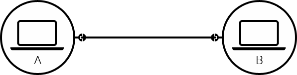
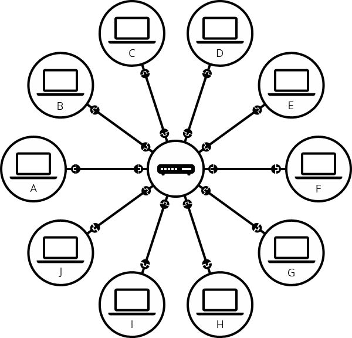
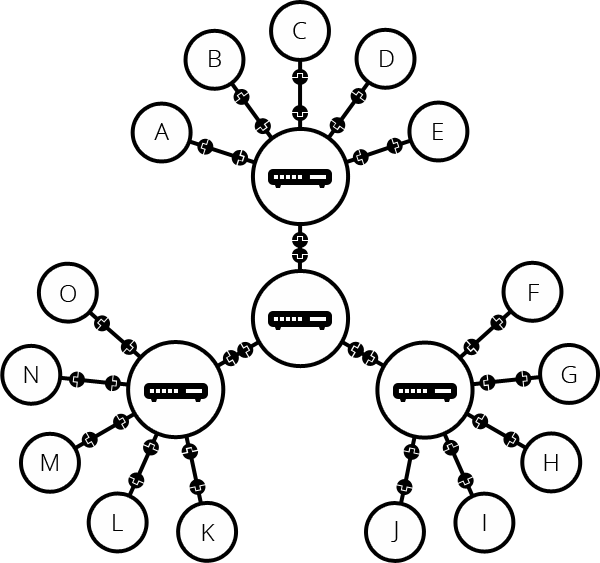

# 인터넷이 동작하는 방법

> **How does the internet work?
인터넷은 어떻게 동작하는가?**

### 인터넷(Internet)이란?
사전적 의미로는 전 세계의 컴퓨터를 연결하여 데이터를 서로 주고 받을 수 있는 거대한 통신망, 컴퓨터 네트워크의 시스템이다.

### 인터넷 역사
자세하게 나오진 않았지만, 1960년에 최초로 등장하였고 그 당시에는 핵이 화두였다.
미국에서 핵 공격을 당했을 때 시뮬레이션을 해보았고 통신쪽에서 큰 약점이 드러났다.
당시에는 통신 시스템이 중앙집중적이었기 때문에 통신이 마비되는 심각한 상황이었고 핵 공격에도 견딜 수 있는 강인한 통신 시스템의 필요했다. 그렇게 탄생된게 **인터넷**이다.

### 인터넷이 동작하는 방식
컴퓨터가 서로 통신하기 위해 물리적으로(이더넷 케이블) 또는 무선으로(WiFi, Bluetooth) 연결되어 있어야한다.
A 컴퓨터가 B 컴퓨터, B 컴퓨터가 A 컴퓨터에게 전기적 신호로 서로 통신을 한다.

여러 컴퓨터가 통신하기 위해서는 **라우터**에 연결된다. 라우터는 전달자로서 요청하는 대상에게 전기적 신호로 통신하고 요청한 대상에게 다시 전기적 신호로 응답하는 역할을 한다.

예를 들어, A 컴퓨터가 B 컴퓨터와 통신을 하려면 라우터에 요청하고 라우터는 B 컴퓨터에게 전달한다.
그리고 B 컴퓨터는 다시 라우터에게 요청하고 라우터는 A 컴퓨터에게 전달한다.

더 많은 컴퓨터를 연결하기 위해 컴퓨터는 라우터에게 연결하고 라우터는 라우터끼리 연결하여 무한히 확장할 수 있다.

아주 먼 거리의 지역까지 연결하기 위해 **인터넷 서비스 제공 업체(Internet Service Provider, ISP)**를 이용하여 연결한다.
인터넷 서비스를 제공하는 업체로 한국에서는 대표적으로 **KT, SK, LG U+** 등이 있다.
ISP는 라우터를 관리하고 다른 ISP의 라우터와도 연결한다.

**따라서, 인터넷은 위와 같은 방식으로 거대한 네트워크 인프라를 구성하게 된다**

인터넷이 어떻게 거대한 통신망을 구성하게 됐는지 알아봤다. 다음엔 좀 더 깊게 들어가보려고 한다.
끝!

### 출처
https://developer.mozilla.org/ko/docs/Learn/Common_questions/How_does_the_Internet_work

https://opentutorials.org/course/3084
